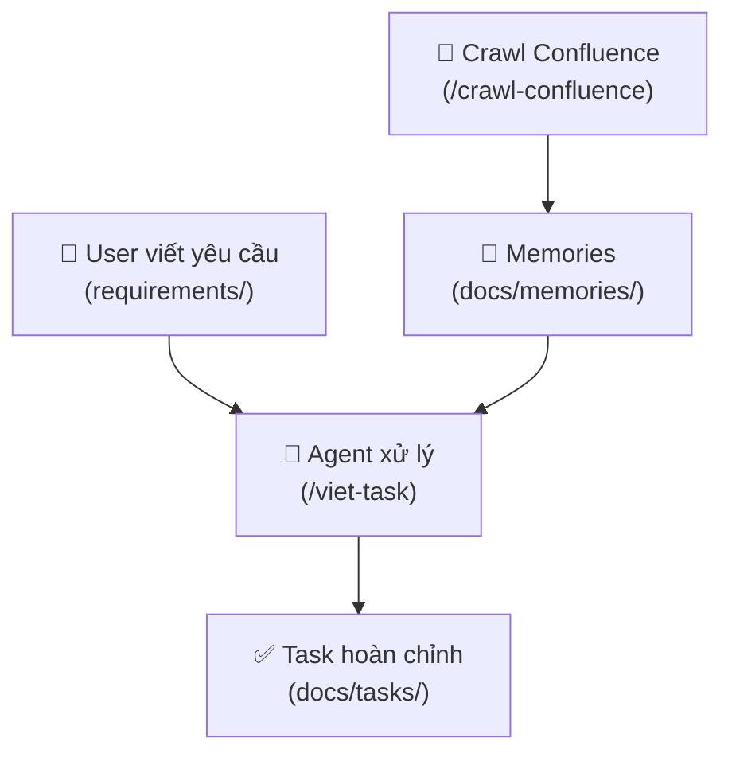

# BA Agent

**Business Analyst Agent** — AI agent tạo task BA từ feedback/requirements.

## Flow



**2 bước**:
1. `/crawl-confluence` — crawl docs Confluence về `docs/memories/` (hiểu sản phẩm/module)
2. `/viet-task` — đọc memories + requirements → tạo task vào `docs/tasks/`

## Cách sử dụng

### Bước 1: Crawl Confluence về memories

```
/crawl-confluence 124190721 --children
```

Agent crawl page + children → lưu `docs/memories/` → cập nhật INDEX

### Bước 2: Viết requirements

Tạo file trong `requirements/`, viết bằng ngôn ngữ tự nhiên:

```markdown
# requirements/them-dark-mode.md

Trang dashboard chỉ có giao diện sáng, user phản hồi dùng ban đêm
bị chói. Muốn thêm dark mode, có toggle ở header, lưu preference.
```

### Bước 3: Tạo task

```
/viet-task requirements/them-dark-mode.md
```

Hoặc viết trực tiếp:

```
/viet-task User muốn thêm pagination cho dashboard khi có hơn 100 records
```

Agent đọc memories (style reference) + requirements → tạo task chuyên nghiệp → lưu `docs/tasks/`

## Cấu trúc dự án

```
ba-agent/
├── .agent/
│   ├── rules/                  # Agent rules (always-on)
│   ├── skills/                 # Agent skills (Matt Pocock, convert-doc)
│   └── workflows/              # BA workflows
│       ├── crawl-confluence.md     # Crawl Confluence → memories
│       └── viet-task.md            # Requirements + memories → task
├── templates/                  # Task templates (fallback khi chưa có memories)
│   ├── task-default.md
│   ├── task-bug-fix.md
│   └── task-feature.md
├── requirements/               # Input: user viết yêu cầu tự nhiên
├── docs/
│   ├── memories/               # Confluence docs đã crawl (style reference)
│   ├── tasks/                  # Output: task đã tạo
│   └── guide/                  # Hướng dẫn sử dụng
├── .gemini/settings.json       # MCP config (gitignored)
├── .env.local                  # Credentials (gitignored)
└── CLAUDE.md
```

## MCP Integrations

| MCP Server | Mục đích | Trạng thái |
|-----------|---------|-----------|
| [mcp-atlassian](https://github.com/sooperset/mcp-atlassian) | Đọc Confluence (READ-ONLY) | ✅ Connected |

> **Confluence = READ-ONLY** — chỉ đọc, mọi output lưu local trong `docs/tasks/`

> **Config**: `.gemini/settings.json` + `.env.local` (cả 2 gitignored)
